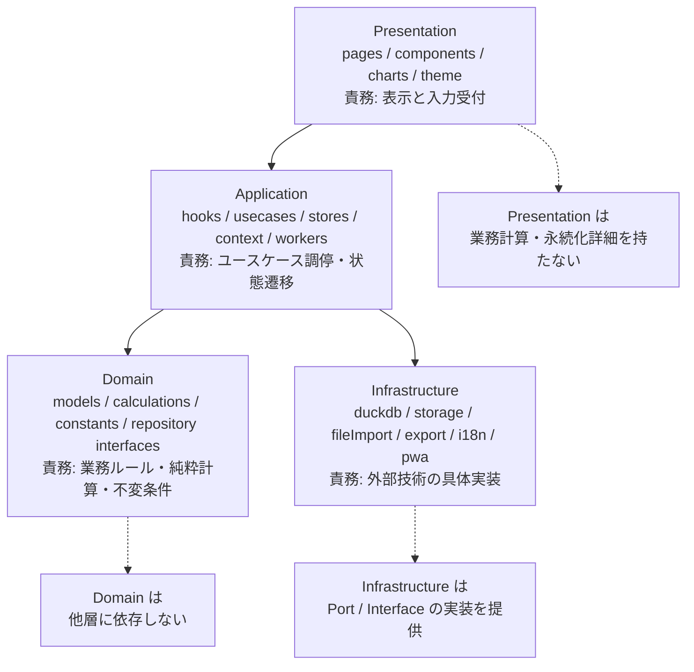
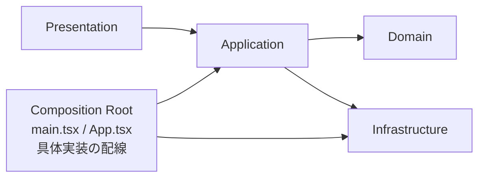
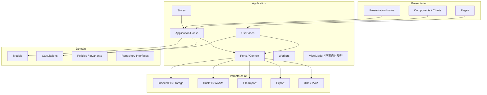
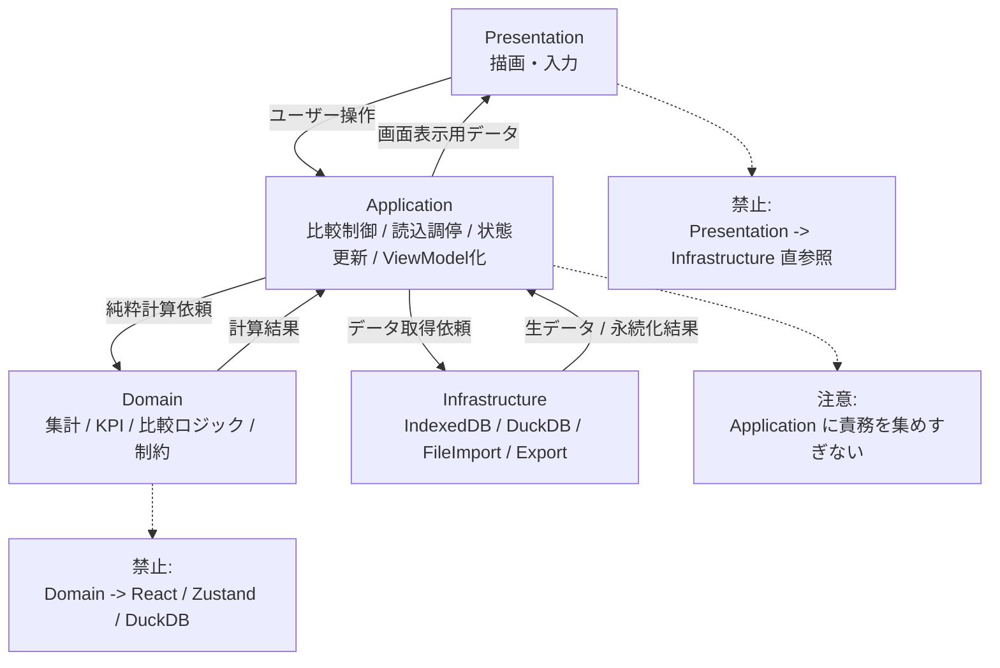

# アーキテクチャ4層構成図

Presentation は表示に専念し、Application はユースケースを調停し、Domain は業務的正しさを定義し、Infrastructure は外部技術を実装する。依存の中心は Domain に寄せ、具体実装の配線は Composition Root に集約する。

```
Presentation = 見せる
Application  = 進める
Domain       = 正しさを決める
Infrastructure = 外界と繋ぐ
```

## 基本レイヤー図



## 依存方向を強調した図



## 実務向けの責務分解図



## 守りたい境界を入れた図


